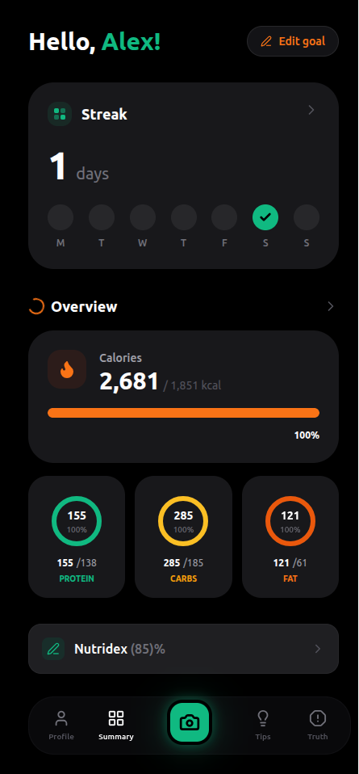
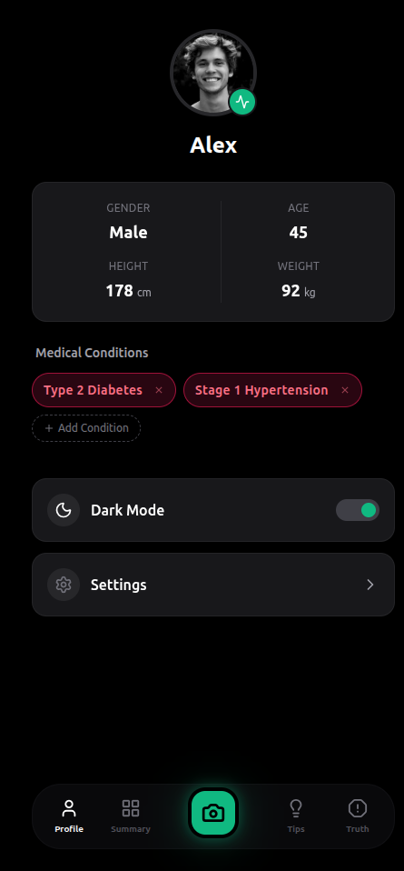
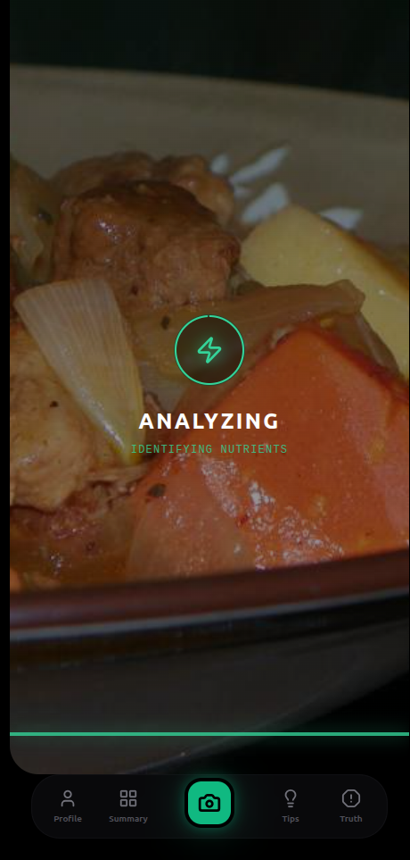
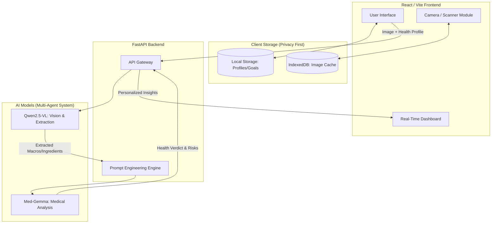

# 🍎 NutriScan AI: The Smart Food Scanner for Your Health

<div align="center">

[](#link-to-kaggle-submission)
[](#link-to-backend-repo)



</div>

## 🤖 Core AI Models (Powered by Kaggle)
*   **[Qwen/Qwen2.5-VL-7B-Instruct](https://huggingface.co/Qwen/Qwen2.5-VL-7B-Instruct):** The "OCR text reader", accurately extracts complex tables and ingredient lists from nutritional labels.
*   **[HackerAditya56/NutriScan-3B](https://huggingface.co/HackerAditya56/NutriScan-3B):** Custom 3B adapter (Qwen2.5-VL-3B-based) tuned explicitly for fresh food estimation and dish detection.
*   **[google/medgemma-1.5-4b-it](https://huggingface.co/google/medgemma-1.5-4b-it):** The "Medical Agent." Uses the parsed nutritional info alongside the user's specific biometric data to flag personalized risks and verdicts.

## 🚨 The Problem: Eating Shouldn't Be a Guessing Game

Have you ever stared at a dense, confusing nutritional label and wondered: *"Is this actually safe for me?"* For individuals managing health conditions like **Diabetes, Asthma, or severe allergies**, a single misjudged ingredient can have immediate and serious consequences. 

The world needs a solution that bridges the gap between complex food science and everyday decision-making. **NutriScan AI** empowers users with instant, hyper-personalized health insights—turning overwhelming labels into clear, decisive action.

---

## 📸 Screenshots

| Home Dashboard | AI Analysis & Health Warnings |
| :---: | :---: |
|  |  |
| **User Profile & Bio-Tracking** | **Nutridex History** |
|  |  |

---

## 🧠 AI & Multi-Agent Architecture (Front-and-Center)
We didn't just build a scanner; we built a **Privacy-First, Dual-Vision AI Health Partner**. NutriScan AI's intelligence is powered by a sophisticated multi-agent system designed for speed, accuracy, and rigorous user privacy.

*   **Qwen2.5-VL-7B-Instruct & NutriScan-3B (Vision Agents):** Our "Readers & Estimators." Need to scan a dense nutrition table? The 7B model instantly extracts the deepest OCR details. Scanning a fresh plate of food? The specialized 3B adapter acts as an estimator, visually breaking down ingredients and macros on the fly.
*   **Google Med-Gemma 1.5-4b-it (Medical Agent):** Our "Health Specialist." Raw data isn't enough. Med-Gemma leverages advanced clinical context to cross-reference food data with your specific bio-profile (e.g., Asthma, Pre-Diabetic). 

### 🛡️ Privacy-First & Secure Data Handling
Your health data is exclusively yours. All user profiles and biometric data are securely managed via **Local Storage / IndexedDB**. When our system utilizes prompt engineering to calculate personalized health risks, we ensure sensitive data flows directly between the securely tunneled backend and the client—**never stored or exposed on external servers**.

---

## ⚙️ System Architecture 



---

## ✨ Features That Supercharge Your Diet

*   🔍 **AI Vision Engine:** Instantly decode nutrition labels or estimate macros for fresh, unlabelled dishes.
*   📊 **Real-Time Interactive Dashboard:** Dazzling macro rings (Calories, Protein, Carbs, Fat, Sugar) that animate and react to your daily logs.
*   ⚠️ **Smart Health Alerts:** Get direct, color-coded health verdicts (`SAFE`, `WARNING`, `DANGER`, `ALLERGY`) uniquely tailored to *your* medical conditions.
*   🎯 **The Nutridex Score System:** A 0-100 rating algorithm that grades your daily nutrition quality and builds interactive timelines.
*   🎨 **Premium Design & UX:** Stunning dark-mode aesthetics, Framer Motion-powered transitions, and fully responsive layouts that feel like a native app.

---

## 🚀 Installation & Local Setup

> **Heads up!** You'll need the FastAPI backend running for the AI to process images. Make sure you point the `.env` file to your active backend tunnel (e.g., Ngrok).

```bash
# 1. Clone the repo and navigate into it
git clone https://github.com/your-username/nutriscan-ai.git
cd nutriscan-ai

# 2. Install Dependencies
npm install

# 3. Configure API Environment
echo "VITE_API_BASE_URL=http://localhost:8000" > .env

# 4. Fire up the Development Server
npm run dev
```

---

## 🔮 What's Next? (Future Roadmap)

We're barely scratching the surface of what NutriScan AI can do. Our visionary roadmap includes:

*   ⌚ **Wearable Data Integration:** Sync with Smartwatches and **Continuous Glucose Monitors (CGMs)** to validate food impact against real-time blood sugar spikes!
*   🌐 **Expanded Local Privacy Framework:** Migrating even more of the multi-agent decision processing entirely on-device to ensure zero-latency, 100% offline security.
*   🥗 **AI-Generated Meal Prep:** Leveraging Med-Gemma to dynamically build weekly grocery lists directly from an automated analysis of your previously safe-scanned foods.

---

## 🙏 Acknowledgments

*   **AI Models**: Qwen2.5-VL, MedGemma by Alibaba/Google.
*   **Icons & Assets**: Lucide React.
*   **Animations**: Framer Motion.
*   *Built specially for the Kaggle Med-Gemma Impact Challenge*

---

<div align="center">
  <b>Built with ❤️ by <a href="#link-to-your-github">Aditya Nandan</a></b>
</div>
